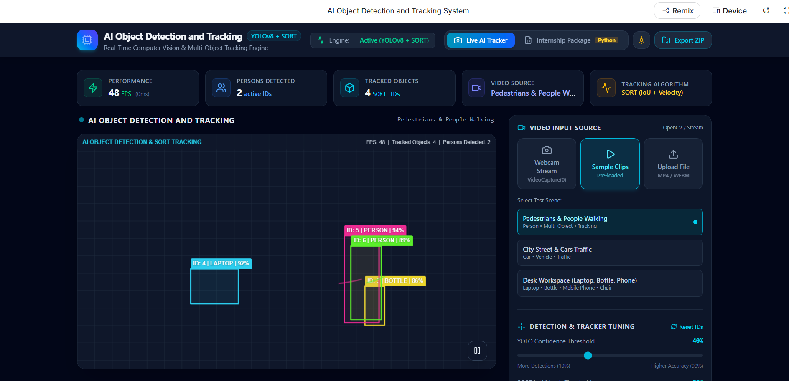

# AI Object Detection and Tracking System

A real-time AI object detection and multi-object tracking system developed with **python**,**OpenCV**, **Ultralytics YOLOv8 Nano (`yolov8n.pt`)**, and the **SORT (Simple Online and Realtime Tracking)** algorithm.


Real-time AI-powered object detection and multi-object tracking dashboard built using **Python, OpenCV, and SORT Tracking Algorithm**.

## 📸 Live Dashboard Preview


## 📸 Project Screenshots

### Detection Output 1


### Detection Output 2


## Live working Demo 
[Watch Working Demo](https://drive.google.com/file/d/1pDpxo_lyR9LvFW4jQbF-Y3ArGNTlaUGV/view?usp=sharing)

Real-time AI-powered object detection and tracking using **Python, OpenCV, and NumPy**.
Designed as a lightweight, beginner-friendly Python solution suitable for internship submissions and computer vision assignments.
it detects moving objects from a video or webcam and tracks them with unique IDs.
---

## 🌟 Key Features

- 📹 **Real-Time object detection Webcam & Video Support**: Stream live frames from `VideoCapture(0)` or load stored `.mp4` video files.
- 🎯 **YOLOv8 Nano Detection**: Detects COCO dataset classes including `Person`, `Bottle`, `Chair`, `Mobile Phone`, `Laptop`, `Car`, and more.
- 🆔 **SORT Object Tracking with unique IDs**: Assigns unique, persistent tracking IDs to detected objects across frames.
- 📊 **Live On-Screen Overlay**: Displays Bounding Boxes, Confidence Scores, Object Labels, Real-time FPS, and Person Counters.
- ⚡ **Lightweight & GPU-Optional**: Optimized to run smoothly on standard laptops without requiring a discrete GPU.
      ** Bounding Box visualization**
      ** simple and efficient implementation**

--- ## Working Demo

This project performs **real-time object detection and tracking** using a webcam or video source. The dashboard displays:

- FPS (Frames Per Second)
- Active person IDs
- Tracked objects count
- Live analytics chart
- Bounding boxes around detected objects

## 📂 Project Structure

```text
ObjectDetectionTracking/
│── app.py             # Main application entry point
│── sort.py            # SORT tracker algorithm implementation
│── requirements.txt   # Python dependency list
│── yolov8n.pt         # Pre-trained YOLOv8 Nano weights (auto-downloaded on first run)
└── README.md          # Setup and usage documentation
```

---

## ⚙️ Installation & Setup

### 1. Prerequisites
Ensure you have **Python 3.8 or higher** installed on your computer.

### 2. Clone or Extract Project
Extract the downloaded ZIP package or navigate into your project directory:
```bash
cd ObjectDetectionTracking
```

### 3. Create a Virtual Environment (Recommended)
```bash
# On Windows:
python -m venv venv
venv\Scripts\activate

# On macOS/Linux:
python3 -m venv venv
source venv/bin/activate
```

### 4. Install Dependencies
```bash
pip install -r requirements.txt
```

---

## 🚀 How to Run

### Run with Webcam (Default)
```bash
python app.py
```

### Run with Video File
Open `app.py` and update line 27:
```python
video_source = "sample_video.mp4"  # Replace 0 with video path
```
Then execute:
```bash
python app.py
```

### Exit Application
Press **'q'** on your keyboard while focusing on the video window.

---

## 📺 Expected Output Display Format
the system opens a webcam or video feed, detect objects , draws bounding boxes around them , and displays a unique tracking ID for each detected object in real time . 

Bounding box banner format:
```text
ID: 1 | Person
ID: 2 | Bottle
ID: 3 | Laptop
```

Top HUD Info Bar:
```text
FPS: 30 | Tracked Objects: 3 | Persons Detected: 1
```

---

## 🛠️ Tech Stack & Libraries
- **Python and numpy**: Primary programming language
- **OpenCV (`cv2`)**: Frame rendering, image processing, and window management
- **Ultralytics YOLOv8**: Modern real-time object detection model
- **SORT**: Simple Online Realtime Tracking using Kalman Filter and Hungarian Algorithm
- **FilterPy & SciPy**: Linear algebra and tracking estimation state updates

---

## 📜 License
This project is open-source and intended for academic and internship demonstration purposes.
this project is created for educational and learning purposes.

## Author
Shalu Mahur
B.Tech CSE(AI&ML)
Sunderdeep Engineering College 
